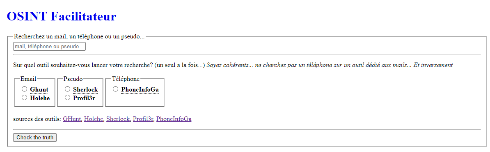

# OSINT Facilitateur
Il s'agit uniquement d'un framework destiné à rendre disponible en web des outils d'OSINT disponibles en ligne de commande, sur un serveur.
C'est un "All-In-One" comprenant le serveur web et toutes les dépendances.



### Utilisation:
Ouvrez votre navigateur et rendez-vous sur l'adresse IP de la machine sur laquelle ce framework est installé, entrez une recherche, choisissez l'outil qui vous intéresse et cliquez sur le bouton.

En fonction de l'outil choisi, un script PHP va envoyer un mot clé au script bash "tools.sh", qui va lui même exécuter l'outil en question.
L'hôte va executer l'outil et transformer le résultat en une page html que le site va ensuite afficher.

Le temps de traitement varie de quelques secondes a quelques dizaines de secondes. Il se peut que le navigateur ne vous affiche aucun résultat. Dans ce cas, attendez quelques secondes et raffraichissez la page.

### Liste d'outils:
* [Ghunt] (https://github.com/mxrch/GHunt)
* [Holehe] (https://github.com/megadose/holehe)
* [Sherlock] (https://github.com/sherlock-project/sherlock)
* [Profil3r] (https://github.com/Rog3rSm1th/Profil3r=)
* [PhoneInfoGa] (https://github.com/sundowndev/phoneinfoga)

### Fonctionalités:
Le serveur web utilisé est l'image docker officielle de [Caddy] (https://caddyserver.com/) accompagné d'une autre image PHP. Dans sa configuration actuelle, il écoute le port 80, en http. Idéal pour un serveur accessible en LAN seulement.

Si vous envisagez de le rendre disponible en ligne, avec un nom de domaine par exemple, il faudrait modifier la première ligne du fichier "osint/conf/Caddyfile" et remplacer ```:80``` par votre nom de domaine (par exemple ```exemple.com```), ce qui aurait pour effer de générer automatiquement un certificat SSL.

Chaque autre outil est également un container docker, avec une image officielle lorsque disponible, sinon "dockerisée" par mes soins.

Les programmes sont appelés par un script bash, au travers d'un tube nommé, ce qui a pour effet de permettre au container caddy d'envoyer des mots clés à l'hôte, ce qui déclanche l'exécution du bon programme.

### Installation:
Il vous faut un serveur, une machine virtuelle ou un ordinateur fonctionnant sous linux et sur lequel vous avez des droits d'administration et les paquets "git", "docker", "docker-compose" et "colorized-logs" d'installés. J'ai uniquement testé les distribution debian et ubuntu.

Clonez le dépôt:  <br>
```git clone https://github.com/MrNonoss/osint.git``` <br>
Déplacez-vous dans le répertoire créé: <br>
```cd osint``` <br>
Puis lancez le script d'installation en sudoer et laissez-vous guider. <br>
```sudo ./run.sh``` <br>

### Configuration du serveur:
Le script d'installation ```run.sh```va modifier le système. Je vous encourage fortement a lire son contenu.

Pour résumer, il va: <br>
* vérifier les prérequis du système
* corriger les droits des répertoires contenus dans le dossier de travail
* mettre à jour le fuseau horaire (utile pour les VPS)
* télécharger les images docker (ce qui prend du temps)
* copier les scripts dans ```/usr/local/bin```
* créer le tube nommé ainsi que le service permettant de rendre l'écoute permanente (y compris après un redémarrage)
* paramétrer la rotation des logs caddy à l'aide d'un fichier de configuration logrotate
* ajouter des tâches cron pour les logs et le redémarrage du service à intervalles réguliers
* lancer le docker-compose qui va lancer tous les services

### Emplacement des fichiers:
* La configuration du serveur caddy et de php se trouve dans le répertoire ```conf```.
* Le corps du site ainsi que le script php se trouvent dans ```html```. Ce répertoire contient également un sous répertoire ```results``` qui va recevoir la page HTML affichée au navigateur.
* Le répertoire ```logs``` contient les logs d'accès au site, ainsi que l'historique des recherches effectuées.

Have fun !!
